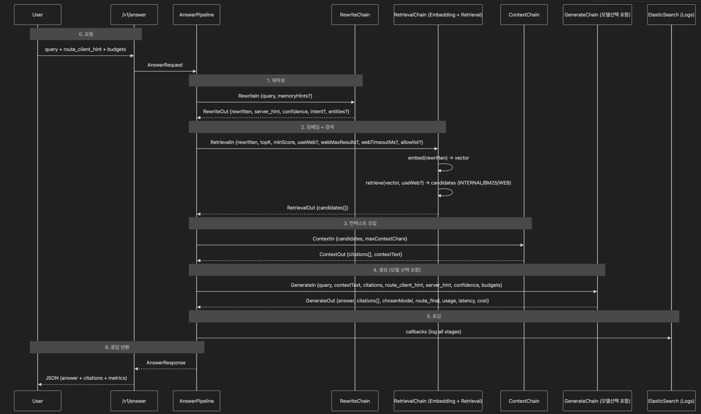

# 🥔 ChattyPotato

> **AI Hackathon 2025 | Team IA_X**  
> 혼합형 라우팅 기반 RAG 시스템 — *“최적의 모델을 똑똑하게 선택하고, 빠르게 대답한다.”*

---

## 🚀 프로젝트 개요

**ChattyPotato**는 LLM 기반 Q&A 시스템에 **하이브리드 라우팅(저비용 ↔ 고성능 모델 자동 분기)**을 결합한  
**RAG (Retrieval-Augmented Generation)** 파이프라인입니다.

> “질문을 이해하고, 문맥을 찾아, 가장 적절한 모델로 대답한다.”

### 🎯 주요 특징
- 🧠 **Retrieval**: 내부 + 웹 기반 문서 검색 (Vector + BM25)
- 🧩 **Augmentation**: 문서 요약 및 컨텍스트 조립
- ⚙️ **Generation**: 프롬프트 구성 + 모델 선택 + 응답 생성
- 🔀 **Routing**: 클라이언트 vs 서버 모델 자동 결정
- 📊 **Observability**: ElasticSearch 기반 전 단계 로깅

---

## 🧱 기술 스택

| 구분 | 기술 |
|------|------|
| **Backend** | Spring Boot 3.x, Java 21 |
| **LLM APIs** | AWS Bedrock (Titan Embeddings, Claude 3, Mistral), OpenAI GPT-4o |
| **Vector Store** | Elasticsearch Vector Index |
| **Observability** | ElasticSearch (Logs + TraceId), Micrometer, OpenTelemetry |
| **Async Handling** | CompletableFuture, Custom Executor |
| **Build/Deploy** | Gradle, Docker, AWS ECS Fargate |

---

## 🧭 전체 데이터 플로우

---

# Java_langchainLike 설계 및 책임 범위

## ⚙️ 1️⃣ RetrieveChain

**역할:** 질의 재작성 → 임베딩 → 문서 검색 (내부 + 웹)

**핵심 키워드:** *Query Understanding & Knowledge Retrieval*

### 📌 책임

| 범주 | 설명 |
| --- | --- |
| 🔤 **입력 정규화 / 재작성** | 사용자의 원문 query를 의미적으로 풍부하게 바꾸기 위해 LLM(cheap model)을 사용함. 예: “제주 숙소 추천” → “제주 2박3일 저예산 숙소 추천 리스트 최신 정보” |
| 🧠 **임베딩(Embedding)** | 재작성된 질의를 벡터로 변환하여 의미 기반 검색을 수행함. |
| 📚 **지식 검색(Retrieval)** | **VectorStoreRetriever**: 벡터 유사도 기반 내부 문서 검색 |
| ⚖️ **결과 병합(ScoreMerger)** | 세 가지 검색 결과를 점수 기반으로 통합 후 후보(candidates[]) 생성. |

---

## 🧩 2️⃣ AugmentChain

**역할:** 검색 결과를 LLM이 이해할 수 있는 컨텍스트 블록으로 재구성

**핵심 키워드:** *Context Assembly & Citation Generation*

### 📌 책임

| 범주 | 설명 |
| --- | --- |
| ✂️ **문서 요약 / 스니펫 추출** | 각 candidate에서 핵심 문장만 뽑아내고, 과도한 텍스트는 제거함. |
| 🧱 **컨텍스트 블록 구성(Context)** | 여러 인용문을 묶어서 LLM에 전달할 **하나의 contextText** 문자열 생성. |

---

## 🤖 3️⃣ GenerateChain

**역할:** 컨텍스트 기반 답변 생성 + 모델 선택 + 비용/시간 측정

**핵심 키워드:** *LLM Reasoning & Routing Decision*

### 📌 책임

| 범주 | 설명 |
| --- | --- |
| 🧾 **프롬프트 조립** | 사용자 질의 + contextText + citations(예정)를 종합하여 답변용 Prompt 구성. |
| 🧠 **LLM 생성(Answer Generation)** | 선택된 모델로 답변을 생성하고, JSON 형식(답변, 인용, 메타데이터)으로 파싱. |
| ⏱️ **성능/비용 측정** | latency, token usage, cost 계산 후 응답 DTO에 포함. |

---

리트리벌 체인 → 현재 쿼리 리라이팅 → 임베딩 검색 → (vector & web검색)문서들 + 리라이팅된 쿼리 반환(DTO)

아구먼트 체인 → 문서 + 쿼리 → 하나의 질문 (문맥 섹터 + 질문섹터) → 문맥 섹터 제한에 맞게 문서 요약 (LLM)
→ 쿼리 섹터에 맞게 쿼리 요약(LLM) → 문맥 섹터 + 질문 섹터 컨텍스트 블럭(DTO)

제너레이트 체인 → 가공한 대화 문맥 생성 → llm에 보내기 → 받은 답변 저장(DTO)

---

## 토큰 제한 처리 과정

| 단계 | 처리 방식 | 설명 |
| --- | --- | --- |
| Retriever | 상위 N개 문서 제한 (`limit(10)`) | 빠른 컷 |
| AugmentedChain | `TokenCounter`로 토큰 누적 제한 | 안전 컷 |
| PromptAssembler | 전체 prompt 토큰 검증 | 최종 컷 |

## 최종 프롬프트 토큰 수

| 섹션 | 목적 | 토큰 수 (권장) | 비율 | 근거 |
| --- | --- | --- | --- | --- |
| 🟩 **System Prompt** | 모델 역할 정의 (“너는 여행 큐레이터야...”) | **150–250** | 10% | 짧지만 톤/역할 결정. 응답 일관성 확보용. |
| 🟦 **Rewrite Query** | 검색 및 라우터 입력용 핵심 문장 | **≤100** | 5% | BERT/BART 점수 비교의 기준. 짧을수록 라우팅 정확도 ↑ |
| 🟪 **Original Query (Reinjection)** | 원문의 뉘앙스·의도 복원 | **300–500 (최대 512)** | 20–25% | 긴 질문도 nuance 유지. 단, 500 넘으면 LLM context 압박. |
| 🟨 **Retrieved Context (Docs)** | 검색된 문서 요약/근거 제공 | **900–1200** | 45–50% | 문서당 512tokens 요약 × 2~3개. 정보 밀도 유지. |
| 🟥 **Instruction / Output Format** | JSON 응답 지시 or 스타일 지정 | **150–250** | 10% | 모델 출력을 구조화하기 위한 명시. |
| ⚪ **총합 (입력)** |  | **1800–2200 tokens** | 100% | 8k 모델 대비 25–30% 사용 → 안정 + 빠름 |